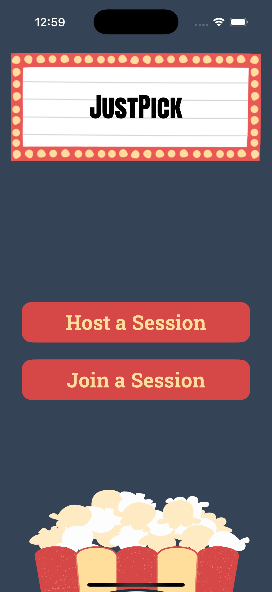

# JustPick 🍿🎬

JustPick is a SwiftUI-based iOS app that helps groups of friends decide on a movie to watch together. Users can create or join movie-picking sessions, vote through popular movies, and get notified when everyone likes the same movie.

## Features

- **Host Sessions**: Create a movie-picking session and share the code with friends
- **Join Sessions**: Enter a session code to join friends' movie-picking sessions
- **Real-time Voting**: Like or dislike movies and see matches instantly
- **Movie Details**: View movie posters, titles, and descriptions from TMDB
- **Match Notifications**: Get notified when all session participants like the same movie

## Technnology Used

- **Frontend**: SwiftUI
- **Backend**: Firebase (Authentication, Firestore)
- **API**: TMDB (The Movie Database) API
- **iOS Target**: iOS 17.0+

## Screenshots

## App Preview

    
    
    

    
    

## Key Components

### Views
- `HomeView`: Main landing page with options to host or join sessions
- `HostSessionView`: Input session title, the name you would like to display for this session, and which movie genres you'd be willing to watch
- `JoinSessionView`: Input the code of the session you'd like to join and the name you'd like to display in the session
- `SessionView`: Main movie viewing and voting interface
- `MatchOverlay`: Displays when a movie match is found

### Managers
- `FirebaseManager`: Handles authentication and Firestore operations
- `NetworkManager`: Manages TMDB API calls and movie data

### Custom Components
- `MovieCard`: Reusable movie poster display component
- `VoteButton`: Customizable like/dislike buttons

## Setup
### Please contact me regarding setup if you have questions 
1. Clone the repository
2. Add your TMDB API credentials to `info.plist`:
   - `TMDB_API_KEY`
   - `TMDB_API_READ_ACCESS_TOKEN`
3. Configure Firebase:
   - Add `GoogleService-Info.plist`
   - Enable Anonymous Authentication
   - Set up Firestore Database

## Dependencies

- Firebase/Auth
- Firebase/Firestore
- Custom Fonts:
  - RobotoSlab-Bold
  - RobotoSlab-Regular
  - AntonSC-Regular
